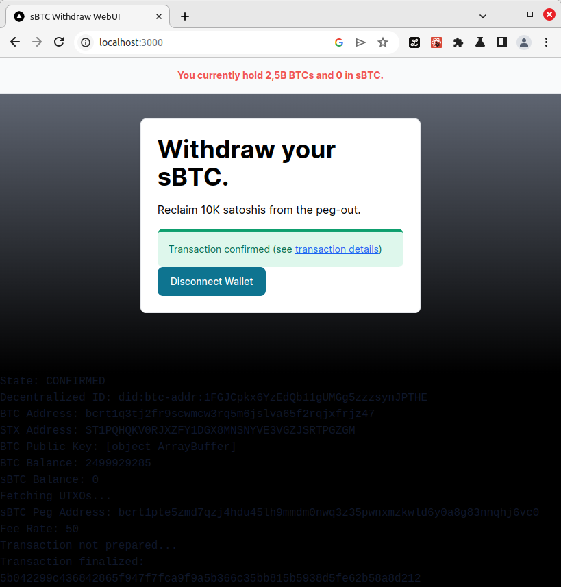

:warning: *This repository moved to a [self-hosted DevOps platform](https://git.indyfac.ch/amin/Webui_sBTC_Withdraw) and is archived here.*

# Web Interace to withdraw sBTC

This interace has been developed within the sBTC Developer Release Program.

## Usage

Make sure you have your [sBTC Development Environment](https://github.com/stacks-network/sbtc/tree/main/devenv) up and running.
After fetchinng the dependencies with `yarn install`, you can start the web interface with `yarn dev`.
The web UI is accessible at `http://localhost:3000/`.

## Screenshots

## License
[GPL-3.0-or-later](./LICENSES/GPL-3.0-or-later.txt)
